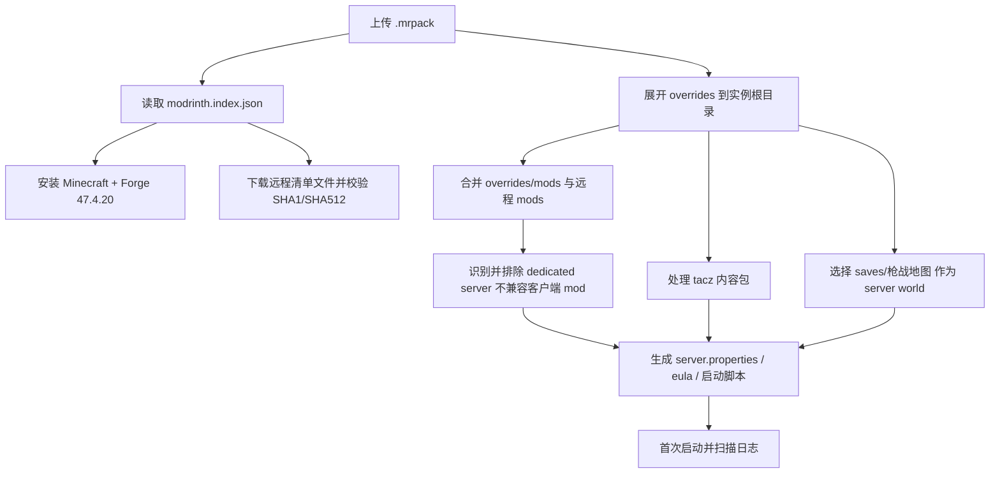

# BattleArmory TACZ 1.6.4-hotfix.2.mrpack 分析报告

- 分析时间：2026-07-19 14:06:14
- 源文件：`C:\Users\Administrator\Downloads\BattleArmory TACZ 1.6.4-hotfix.2.mrpack`
- 文件大小：320.68 MB
- ZIP 条目数：1620 个文件
- 解压后总大小：379.90 MB

## 1. 总体结论

这是一个标准 Modrinth `.mrpack` 整合包。根索引 `modrinth.index.json` 声明了 `BattleArmory TACZ` / `1.6.4-hotfix.2`，目标环境是 Minecraft `1.20.1` + Forge `47.4.20`。

从结构看，它不是一个纯“模组列表包”：`overrides/` 中包含大量已随包分发的 TACZ 枪械包资源、自带世界、配置、资源包、光影、小地图数据和少量本地 jar。后续开发如果要做“上传整合包并自动生成服务端”，这个包的关键不是只下载 90 个远程文件，还必须正确处理 `overrides/tacz`、`overrides/saves`、`overrides/config` 和 `overrides/mods`。

## 2. Modrinth 元数据

| 字段 | 值 |
|---|---|
| `formatVersion` | 1 |
| `game` | minecraft |
| `name` | BattleArmory TACZ |
| `versionId` | 1.6.4-hotfix.2 |
| `summary` | 正式版 1.20.1, Forge 47.4.20 |

| 依赖 | 版本 |
|---|---|
| `minecraft` | `1.20.1` |
| `forge` | `47.4.20` |

## 3. 顶层结构

| 顶层路径 | 文件数 | 说明 |
|---|---:|---|
| `overrides` | 1619 | 安装时复制到实例根目录的覆盖内容 |
| `modrinth.index.json` | 1 | Modrinth 包索引，声明远程下载文件、hash 和依赖 |

## 4. 远程清单文件

- `modrinth.index.json` 中声明远程文件：90 个
- 声明下载总大小：295.17 MB
- 下载域名：`cdn.modrinth.com` 90 个
- 所有清单项的 `env.client` / `env.server` 均未显式声明，意味着自动服务端生成器不能直接依赖 Modrinth 的环境标记来排除客户端文件。需要额外做 jar 元数据分析或维护排除规则。

远程清单按路径分类：

| 路径前缀 | 数量 |
|---|---:|
| `mods` | 89 |
| `shaderpacks` | 1 |

体积最大的远程声明文件：

| 大小 | 路径 | 角色推断 |
|---:|---|---|
| 57.82 MB | `mods/[真实物理] physics-mod-3.0.18-mc-1.20.1-forge.jar` | 未知/通用待确认 |
| 54.80 MB | `mods/[永恒枪械工坊：零] tacz-1.20.1-1.1.8-hotfix.jar` | 可能是服务端或通用/玩法核心 |
| 40.52 MB | `mods/[TaC：绿葡萄附属包] lradd-1.20.1-0.3.0.jar` | 可能是服务端或通用/玩法核心 |
| 23.94 MB | `mods/[现代化 UI] ModernUI-Forge-1.20.1-3.12.0.1-universal.jar` | 未知/通用待确认 |
| 11.33 MB | `mods/gd656killicon-1.1.1.003-1.20.1-forge.jar` | 未知/通用待确认 |
| 10.47 MB | `mods/Sounds-2.2.1+1.20.1+forge.jar` | 可能是客户端/视觉/QoL |
| 10.34 MB | `mods/[自定义NPC 非官方版] CustomNPCs-1.20.1-GBPort-Unofficial-1.20.1.20260227.jar` | 未知/通用待确认 |
| 7.13 MB | `mods/fabric-language-kotlin-1.13.6+kotlin.2.2.20.jar` | 可能是服务端或通用/玩法核心 |
| 7.10 MB | `mods/kotlinforforge-4.12.0-all.jar` | 可能是服务端或通用/玩法核心 |
| 5.19 MB | `mods/lrtactical-1.20.1-0.4.1.jar` | 可能是服务端或通用/玩法核心 |
| 5.05 MB | `mods/[玩家救援] PlayerRevive_FORGE_v2.0.31_mc1.20.1.jar` | 未知/通用待确认 |
| 4.51 MB | `mods/[增强视觉效果／拓展视觉效果] EnhancedVisuals_FORGE_v1.8.29_mc1.20.1.jar` | 可能是客户端/视觉/QoL |
| 3.62 MB | `shaderpacks/photon_v1.3b.zip` | 客户端光影包 |
| 2.92 MB | `mods/fabric-api-0.92.6+1.11.14+1.20.1.jar` | 可能是服务端或通用/玩法核心 |
| 2.72 MB | `mods/oculus-mc1.20.1-1.8.0.jar` | 可能是客户端/视觉/QoL |
| 2.61 MB | `mods/fragmentum-forge-1.20.1-1.3.0.jar` | 未知/通用待确认 |
| 2.26 MB | `mods/fzzy_config-0.7.6+1.20.1+forge.jar` | 未知/通用待确认 |
| 2.07 MB | `mods/skinlayers3d-forge-1.11.2-mc1.20.1.jar` | 可能是客户端/视觉/QoL |
| 2.05 MB | `mods/[Xaero的小地图] xaerominimap-forge-1.20.1-26.1.0.jar` | 可能是客户端/视觉/QoL |
| 1.80 MB | `mods/Zoomify-2.14.6+1.20.1.jar` | 可能是客户端/视觉/QoL |

## 5. overrides 内容分布

| overrides 子目录 | 文件数 | 解压大小 | 主要扩展名 |
|---|---:|---:|---|
| `tacz` | 11 | 276.10 MB | `.zip` 9, `.json` 1, `.toml` 1 |
| `saves` | 324 | 62.26 MB | `.dat` 111, `.mca` 89, `.mcfunction` 55, `.json` 47, `.toml` 10, `.pyc` 4 |
| `config` | 1209 | 19.07 MB | `.json` 715, `.toml` 144, `.png` 109, `.ogg` 74, `.txt` 33, `.cfg` 30 |
| `mods` | 11 | 10.40 MB | `.jar` 11 |
| `resourcepacks` | 3 | 10.26 MB | `.zip` 3 |
| `shaderpacks` | 1 | 1.08 MB | `.zip` 1 |
| `xaero` | 44 | 620.58 KB | `.outdated` 22, `.xwmc` 17, `.txt` 4, `(none)` 1 |
| `PCL` | 14 | 67.98 KB | `.png` 7, `.json` 4, `.yml` 1, `.bak` 1, `.ini` 1 |
| `options.txt` | 1 | 12.08 KB | `.txt` 1 |
| `CustomSkinLoader` | 1 | 2.39 KB | `.json` 1 |

### 5.1 TACZ 枪械包资源

`overrides/tacz/` 包含 11 个文件，解压大小 276.10 MB。这些是 TACZ 内容包，通常需要服务端和客户端同时具备匹配内容，否则会出现物品、枪械数据或资源不同步。

| 大小 | 文件 |
|---:|---|
| 95.37 MB | `tacz/[TACZ1.1.6+]Call of Duty Warzone Ver1.1.6F.zip` |
| 54.88 MB | `tacz/[Tacz1.1.7+]CIBR_GunsPack_v0.3_1.1.7.zip` |
| 52.92 MB | `tacz/Suffuse-GunSmoke-Pack1.0.7--hotfix+1.21.1.zip` |
| 19.94 MB | `tacz/[Tacz1.1.5+]TRIS-dyna GunsPack ver1.1.5.zip.zip` |
| 15.07 MB | `tacz/[Tacz1.1.5+]EMX-Arms GunsPack ver1.1.5.zip+1.21.1.zip` |
| 14.95 MB | `tacz/[Tacz1.1.5+] EOS_Dawn Goddess Lab ver1.1.1-hotfix1.zip` |
| 9.68 MB | `tacz/Cyber Armorer-1.1.4.3.1_for114+1.21.1.zip` |
| 6.78 MB | `tacz/Create Armorer-v1.2.0hotfix-for115.zip` |
| 6.51 MB | `tacz/Apocalypse_v1.1.7_G.zip` |
| 436 B | `tacz/.export-state.json` |
| 222 B | `tacz/tacz-pre.toml` |

### 5.2 自带世界/地图

`overrides/saves/` 包含 324 个文件，解压大小 62.26 MB。检测到存档根：`枪战地图` (324 文件)
这说明整合包包含预置地图。如果转换为独立服务端，通常需要把目标存档从 `saves/枪战地图` 复制/重命名为服务器 `world`，并同步 `server.properties` 中的 `level-name`。

### 5.3 本地嵌入 jar

`overrides/mods/` 中直接包含 11 个 jar，解压大小 10.40 MB。这些不在 Modrinth 远程清单下载流程中，需要按普通覆盖文件复制到服务端/客户端。

| 大小 | jar | 初步判断 |
|---:|---|---|
| 4.81 MB | `[信雅互联] Connector-1.0.0-beta.48+1.20.1.jar` | 可能服务端或通用 |
| 1.79 MB | `tritium-forge-1.20.1-26.10.jar` | 可能服务端或通用 |
| 1.13 MB | `alltheleaks-1.1.1+1.20.1-forge.jar` | 可能服务端或通用 |
| 1014.69 KB | `geckolib-forge-1.20.1-4.8.3.jar` | 可能服务端或通用 |
| 783.09 KB | `acceleratedrendering-1.0.10.1-1.20.1-alpha.1.jar` | 可能服务端或通用 |
| 287.31 KB | `[火控辅助]tacz_fire_control_extension-1.1.3+mc1.20.1+tacz1.1.4.jar` | 可能服务端或通用 |
| 239.89 KB | `[遗体] corpse-forge-1.20.1-1.0.23.jar` | 可能服务端或通用 |
| 175.27 KB | `[第三人称射击：零] tp_shooting-1.20.1-5.1.1+tacz1.1.6-all.jar` | 可能服务端或通用 |
| 112.58 KB | `[键位冲突显示] Controlling-forge-1.20.1-12.0.2.jar` | 可能客户端/QoL |
| 75.91 KB | `Searchables-forge-1.20.1-1.0.3.jar` | 可能服务端或通用 |
| 43.35 KB | `[自定义局域网联机] lanserverproperties-1.11.1-forge.jar` | 可能服务端或通用 |

### 5.4 资源包和光影

- `overrides/resourcepacks/`：3 个资源包，10.26 MB
- `overrides/shaderpacks/`：1 个光影包，1.08 MB
- 资源包/光影主要影响客户端。服务端可选择保留资源包用于分发或记录，但光影通常不应进入服务端目录。

## 6. 配置复杂度

`overrides/config/` 有 1209 个文件，解压大小 19.07 MB，说明该整合包对玩法、性能、UI、音效、TACZ 附属内容做了大量配置。

配置目录/前缀 Top 30：

| config 子路径 | 文件数 |
|---|---:|
| `(config root)` | 277 |
| `litematica` | 246 |
| `gd656killicon` | 191 |
| `inventoryprofilesnext` | 153 |
| `universalenchants` | 86 |
| `minihud` | 37 |
| `lucky` | 31 |
| `forgematica` | 26 |
| `ironchests` | 23 |
| `xaero` | 16 |
| `apotheosis` | 9 |
| `jei` | 9 |
| `cataclysm` | 8 |
| `Obscuria` | 7 |
| `physicsmod` | 7 |
| `betterstrongholds` | 6 |
| `jade` | 6 |
| `roughlyenoughitems` | 6 |
| `NoChatReports` | 5 |
| `sounds` | 5 |
| `betterdeserttemples` | 4 |
| `ModernUI` | 4 |
| `sound_physics_remastered` | 4 |
| `taczexpands` | 4 |
| `betterfortresses` | 3 |
| `carpettisaddition` | 3 |
| `oreexcavation` | 3 |
| `pickupnotifier` | 3 |
| `artifacts` | 2 |
| `asyncparticles` | 2 |

## 7. 服务端生成风险点

1. **没有显式环境标记**：90 个远程清单项全部省略 `env`，自动工具需要自行判断客户端专用 mod。
2. **客户端功能 mod 较多**：例如小地图、世界地图、光影、Oculus、Embeddium、动态光源、Zoomify、Inventory HUD、Controlling、输入法、视觉增强等，大多不应直接放进 dedicated server。
3. **TACZ 内容包很大且很关键**：`tacz/` 目录是玩法核心，服务端包生成时必须保留；同时客户端也要同步。
4. **自带地图需要特殊处理**：`saves/枪战地图` 不是标准服务端 `world` 根路径，开服器需要提供“选择预置存档并作为 world 启动”的逻辑。
5. **Forge Connector/Fabric API 混合生态**：包里出现 Connector、ConnectorExtras、Fabric API、Fabric Language Kotlin 等，说明它可能通过 Sinytra Connector 在 Forge 上加载部分 Fabric 生态内容；自动生成器需要保持版本组合完整。
6. **本地嵌入 jar 与远程 jar 混合**：不能只根据 `modrinth.index.json` 下载文件，必须合并 `overrides/mods`。
7. **授权/分发差异**：本包远程下载全来自 `cdn.modrinth.com`，暂未看到 CurseForge manifest；但本地嵌入文件和 TACZ 包仍需尊重各自授权。

## 8. 自动开服/托管平台建议的数据流

## 9. 建议的服务端转换策略

- 第一阶段只做“结构还原”：下载清单文件，复制 `overrides/config`、`overrides/tacz`、必要的 `overrides/mods`，处理地图为 `world`。
- 第二阶段做“服务端净化”：根据 jar 元数据、已知客户端 mod 规则和启动日志，移除视觉/UI/输入/小地图/光影类内容。
- 第三阶段做“可运行验证”：启动 Forge dedicated server，捕获 crash-report 和 latest.log，自动给出需要删除或补齐的 mod。
- 对这个包，不能把 `shaderpacks`、`resourcepacks`、`xaero`、`PCL`、`options.txt` 简单视为服务端必要文件；它们更偏客户端实例状态。

## 10. 生成的辅助清单

- 远程清单 CSV：`BattleArmory_TACZ_manifest_files.csv`
- overrides 文件 CSV：`BattleArmory_TACZ_overrides_files.csv`

## 11. 安全检查

- 路径穿越/绝对路径可疑项：0 个

## 12. 重要文件 Top 30

| 解压大小 | 路径 |
|---:|---|
| 95.37 MB | `overrides/tacz/[TACZ1.1.6+]Call of Duty Warzone Ver1.1.6F.zip` |
| 54.88 MB | `overrides/tacz/[Tacz1.1.7+]CIBR_GunsPack_v0.3_1.1.7.zip` |
| 52.92 MB | `overrides/tacz/Suffuse-GunSmoke-Pack1.0.7--hotfix+1.21.1.zip` |
| 19.94 MB | `overrides/tacz/[Tacz1.1.5+]TRIS-dyna GunsPack ver1.1.5.zip.zip` |
| 15.07 MB | `overrides/tacz/[Tacz1.1.5+]EMX-Arms GunsPack ver1.1.5.zip+1.21.1.zip` |
| 14.95 MB | `overrides/tacz/[Tacz1.1.5+] EOS_Dawn Goddess Lab ver1.1.1-hotfix1.zip` |
| 9.68 MB | `overrides/tacz/Cyber Armorer-1.1.4.3.1_for114+1.21.1.zip` |
| 6.95 MB | `overrides/config/carpettisaddition/mapping/yarn-1.21.1+build.3-v2.tiny` |
| 6.78 MB | `overrides/tacz/Create Armorer-v1.2.0hotfix-for115.zip` |
| 6.51 MB | `overrides/tacz/Apocalypse_v1.1.7_G.zip` |
| 5.29 MB | `overrides/resourcepacks/Minecraft-Mod-Language-Modpack-Converted-1.20.1.zip` |
| 4.89 MB | `overrides/resourcepacks/Gd656Killicon_ResourcePack.zip` |
| 4.81 MB | `overrides/mods/[信雅互联] Connector-1.0.0-beta.48+1.20.1.jar` |
| 4.44 MB | `overrides/saves/枪战地图/region/r.0.0.mca` |
| 4.14 MB | `overrides/saves/枪战地图/region/r.0.-1.mca` |
| 4.06 MB | `overrides/saves/枪战地图/region/r.1.0.mca` |
| 4.05 MB | `overrides/saves/枪战地图/region/r.-1.0.mca` |
| 4.01 MB | `overrides/saves/枪战地图/region/r.-1.-1.mca` |
| 4.01 MB | `overrides/saves/枪战地图/region/r.0.1.mca` |
| 4.01 MB | `overrides/saves/枪战地图/region/r.1.-1.mca` |
| 4.01 MB | `overrides/saves/枪战地图/region/r.2.-1.mca` |
| 4.01 MB | `overrides/saves/枪战地图/region/r.2.0.mca` |
| 3.69 MB | `overrides/saves/枪战地图/region/r.-1.1.mca` |
| 2.51 MB | `overrides/saves/枪战地图/region/r.-2.-1.mca` |
| 2.51 MB | `overrides/saves/枪战地图/region/r.1.-2.mca` |
| 2.51 MB | `overrides/saves/枪战地图/region/r.2.-2.mca` |
| 2.35 MB | `overrides/saves/枪战地图/region/r.1.1.mca` |
| 2.04 MB | `overrides/saves/枪战地图/region/r.-2.0.mca` |
| 1.79 MB | `overrides/mods/tritium-forge-1.20.1-26.10.jar` |
| 1.73 MB | `overrides/saves/枪战地图/region/r.0.-2.mca` |