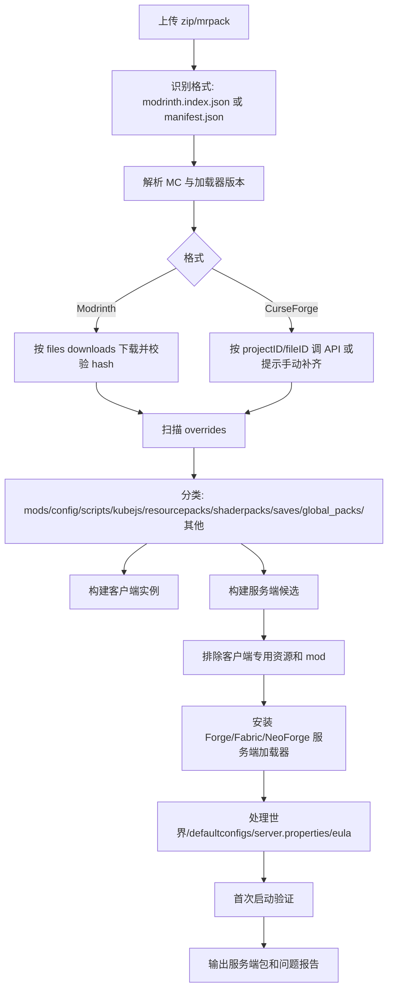

# 整合包结构规律扩展分析：Modrinth + CurseForge + NeoForge

- 分析时间：2026-07-19 14:16:02
- 样本数：5 个
- 覆盖格式：Modrinth `.mrpack`、CurseForge 导出 `.zip`
- 覆盖加载器：Forge、Fabric、NeoForge

## 1. 样本总览

| 样本 | 格式 | MC/加载器 | 包大小 | 解压后 | 远程清单数 | overrides 文件数 | 本地 jar |
|---|---|---|---:|---:|---:|---:|---:|
| BattleArmory TACZ | `modrinth-mrpack` | 1.20.1 / forge 47.4.20 | 320.68 MB | 379.90 MB | 90 | 1619 | 11 |
| 乌托邦探险之旅 | `modrinth-mrpack` | 1.20.1 / fabric-loader 0.18.4 | 718.64 MB | 798.94 MB | 413 | 2694 | 63 |
| RLCraft | `curseforge-zip` | 1.12.2 / forge 14.23.5.2860 | 48.95 MB | 63.86 MB | 187 | 3381 | 3 |
| Into the Backrooms | `curseforge-zip` | 1.20.1 / fabric 0.18.4 | 77.88 KB | 97.96 KB | 36 | 39 | 0 |
| Re-Console LTS NeoForge | `modrinth-mrpack` | 1.21.1 / neoforge 21.1.233 | 9.86 MB | 10.50 MB | 115 | 1855 | 0 |

## 2. 新增 3 个包的关键发现

### RLCraft

- 格式：CurseForge 导出 ZIP，入口是 `manifest.json`，覆盖目录字段为 `overrides`。
- 依赖：`{'minecraft': '1.12.2', 'forge': '14.23.5.2860'}`。
- `files[]` 只有 CurseForge `projectID/fileID/required`，没有直接下载 URL 和 hash；下载器需要接 CurseForge API 或已有镜像。
- ZIP 文件数：3383，overrides 文件数：3381，本地嵌入 jar：3。

| overrides 子目录 | 文件数 | 解压大小 | 主要扩展名 |
|---|---:|---:|---|
| `config` | 2205 | 21.97 MB | `.json` 1166, `.cfg` 488, `.tml` 381, `.png` 35, `.txt` 33 |
| `resources` | 816 | 21.43 MB | `.png` 475, `.json` 226, `.mcmeta` 50, `.lang` 27, `.jpg` 24 |
| `structures` | 338 | 19.05 MB | `.rcst` 211, `.rcig` 73, `.schematic` 39, `.rcgp` 6, `.rcbm` 3 |
| `mods` | 5 | 634.70 KB | `.jar` 3, `.meta` 2 |
| `resourcepacks` | 1 | 402.65 KB | `.zip` 1 |
| `scripts` | 9 | 227.08 KB | `.zs` 7, `.zs test` 1, `.zs asdadasd` 1 |
| `RLCraft v2.9 Changelog.txt` | 1 | 67.58 KB | `.txt` 1 |
| `RLCraft v2.9.3 + v2.9.2d Changelog.txt` | 1 | 45.22 KB | `.txt` 1 |
| `RLCraft v2.9.1c Changelog.txt` | 1 | 15.45 KB | `.txt` 1 |
| `options.txt` | 1 | 4.65 KB | `.txt` 1 |
| `FOR SERVERS ONLY - SET THESE IN SERVER.PROPERTIES.txt` | 1 | 3.33 KB | `.txt` 1 |
| `optionsof.txt` | 1 | 1.40 KB | `.txt` 1 |
| `server.properties` | 1 | 858 B | `.properties` 1 |

### Into the Backrooms

- 格式：CurseForge 导出 ZIP，入口是 `manifest.json`，覆盖目录字段为 `overrides`。
- 依赖：`{'minecraft': '1.20.1', 'fabric': '0.18.4'}`。
- `files[]` 只有 CurseForge `projectID/fileID/required`，没有直接下载 URL 和 hash；下载器需要接 CurseForge API 或已有镜像。
- ZIP 文件数：42，overrides 文件数：39，本地嵌入 jar：0。

| overrides 子目录 | 文件数 | 解压大小 | 主要扩展名 |
|---|---:|---:|---|
| `config` | 37 | 28.11 KB | `.json` 15, `.properties` 11, `.local` 4, `.json5` 2, `.toml` 2 |
| `options.txt` | 1 | 5.07 KB | `.txt` 1 |
| `datapacks` | 1 | 110 B | `.json` 1 |

### Re-Console LTS NeoForge

- 格式：Modrinth `.mrpack`，入口是 `modrinth.index.json`。
- 依赖：`{'minecraft': '1.21.1', 'neoforge': '21.1.233'}`。
- 远程文件有 URL 和 hash，可直接下载并校验。
- ZIP 文件数：1856，overrides 文件数：1855，本地嵌入 jar：0。

| overrides 子目录 | 文件数 | 解压大小 | 主要扩展名 |
|---|---:|---:|---|
| `global_packs` | 205 | 8.69 MB | `.png` 129, `.json` 41, `.cpmmodel` 25, `(none)` 4, `.mcmeta` 3 |
| `resourcepacks` | 1585 | 1.63 MB | `.png` 1508, `.json` 66, `.jem` 5, `.mcmeta` 4, `.ttf` 1 |
| `config` | 64 | 120.49 KB | `.json` 48, `.toml` 6, `.properties` 5, `.json5` 2, `.txt` 1 |
| `modlist.md` | 1 | 2.99 KB | `.md` 1 |

## 3. 五个样本共同规律

### 3.1 所有包都是“清单层 + 覆盖层”

无论是 Modrinth 还是 CurseForge，结构都不是“一个完整服务端目录”。它们都有一个清单入口，再配一个 `overrides` 目录：

- Modrinth：`modrinth.index.json` + `overrides/`
- CurseForge：`manifest.json` + manifest 中指定的 `overrides` 目录

开发含义：自动开服器要先读清单，再处理覆盖层。只处理其中一层都会丢内容。

### 3.2 清单层在两种格式中的差异

| 能力 | Modrinth `.mrpack` | CurseForge ZIP |
|---|---|---|
| 入口文件 | `modrinth.index.json` | `manifest.json` |
| 依赖声明 | `dependencies.minecraft/forge/neoforge/fabric-loader/quilt-loader` | `minecraft.version` + `minecraft.modLoaders[].id` |
| 文件清单 | `files[].path/downloads/hashes/env/fileSize` | `files[].projectID/fileID/required` |
| 直接下载 | 通常可以直接用 `downloads[]` | 通常需要 CurseForge API |
| Hash 校验 | index 内置 SHA1/SHA512 | manifest 本身通常不含文件 hash |

### 3.3 overrides 是复杂度核心

五个样本都存在 `overrides`，并且里面内容非常不统一。常见类别包括：

- `config/`：客户端和服务端配置混在一起。
- `mods/`：本地 jar，可能是私有、改版、非平台分发或作者手动放入。
- `resourcepacks/` / `shaderpacks/`：多为客户端体验内容，但可能影响整合包外观。
- `kubejs/`、`scripts/`、`structures/`、`global_packs/`、`defaultconfigs/`：经常是玩法核心，不能随便丢。
- `saves/`：预置世界，服务端要转换成 `world` 或让用户选择。
- `options.txt`、启动器目录、小地图数据：实例状态，通常不属于服务端核心。

### 3.4 服务端生成不能依赖单一规则

样本里出现了这些反例：

- BattleArmory 的 Modrinth `env` 全省略。
- 乌托邦的 Modrinth `env` 全是 `required/required`，但仍包含大量客户端资源和光影。
- Re-Console 的 Modrinth `env` 同时出现 `required/unsupported` 和 `required/required`，清楚标记了一批客户端专用资源。
- CurseForge manifest 没有直接 URL，也没有 Modrinth 风格的 client/server env。
- RLCraft 1.12.2 是老 Forge 包，结构、配置和任务系统都和现代包不同。

## 4. 新增 NeoForge 样本的意义

Re-Console LTS 是 NeoForge 包，`dependencies` 为：

```json
{
  "minecraft": "1.21.1",
  "neoforge": "21.1.233"
}
```

它说明自动开服器至少要把加载器安装分成独立分支：

- Forge：如 RLCraft、BattleArmory。
- Fabric：如乌托邦、Backrooms。
- NeoForge：如 Re-Console。

NeoForge 不能简单当成 Forge 字段处理。它在 Modrinth 里使用 `dependencies.neoforge`，版本号形如 `21.1.233`，服务端安装、启动参数和依赖解析都应单独封装。

## 5. 推荐自动开服器通用流水线



## 6. 建议抽象出的规则引擎

- `FormatDetector`：判断 Modrinth / CurseForge / 普通 ZIP。
- `LoaderResolver`：解析并安装 Forge/Fabric/NeoForge/Quilt。
- `RemoteResolver`：Modrinth 直接 URL 下载；CurseForge projectID/fileID 解析。
- `OverrideClassifier`：按目录、扩展名、jar 元数据和已知规则分类。
- `ServerPruner`：剔除 shader、UI、小地图、纯客户端优化、启动器状态、`.exe` 等。
- `WorldMapper`：识别 `saves/`、`world/`、`defaultconfigs/` 并映射服务端目录。
- `FirstRunVerifier`：启动一次，分析 `latest.log` / crash-report，给出缺失依赖或客户端 mod 冲突。

## 7. 生成的新增清单文件

| 样本 | 远程清单 CSV | overrides CSV |
|---|---|---|
| RLCraft | `RLCraft_remote_manifest.csv` | `RLCraft_overrides_files.csv` |
| Into the Backrooms | `Into_the_Backrooms_remote_manifest.csv` | `Into_the_Backrooms_overrides_files.csv` |
| Re-Console LTS NeoForge | `Re_Console_LTS_NeoForge_remote_manifest.csv` | `Re_Console_LTS_NeoForge_overrides_files.csv` |

## 8. 新增样本大文件 Top 25

### RLCraft

| 解压大小 | 路径 |
|---:|---|
| 6.02 MB | `overrides/structures/downloads/P_Pack.zip` |
| 5.10 MB | `overrides/config/betterquesting/resources/rlcraft/textures/gui/title_card.png` |
| 3.32 MB | `overrides/resources/mainmenu/background.png` |
| 2.43 MB | `overrides/resources/loadingscreen/options_background2.png` |
| 2.41 MB | `overrides/resources/loadingscreen/options_background.png` |
| 1.92 MB | `overrides/structures/schematics/forestguardian.schematic` |
| 1.49 MB | `overrides/structures/schematics/wonderblue.schematic` |
| 1.11 MB | `overrides/structures/schematics/smok.schematic` |
| 1.09 MB | `overrides/resources/customloadingscreen/textures/progress_bars.png` |
| 925.39 KB | `overrides/structures/inactive/RLCraft_FloatingCity.rcst` |
| 734.19 KB | `overrides/config/betterquesting/DefaultQuests.json` |
| 636.28 KB | `overrides/structures/downloads/Batch_of_updated_builds.zip` |
| 627.51 KB | `overrides/resources/mainmenu/images/11.jpg` |
| 531.51 KB | `overrides/resources/mainmenu/images/7 new.jpg` |
| 505.46 KB | `overrides/resources/mainmenu/images/6 new.jpg` |
| 486.26 KB | `overrides/resources/mainmenu/buttonlong old.png` |
| 474.33 KB | `overrides/structures/schematics/explorersislands10901336.schematic` |
| 469.56 KB | `overrides/resources/mainmenu/images/1 new.jpg` |
| 461.19 KB | `overrides/resources/mainmenu/images/14.jpg` |
| 456.45 KB | `overrides/resources/mainmenu/images/10.jpg` |
| 436.79 KB | `overrides/structures/active/P_IslandCity.rcst` |
| 436.28 KB | `overrides/mods/memory_repo/net/ilexiconn/llibrary-core/1.0.11-1.12.2/llibrary-core-1.0.11-1.12.2.jar` |
| 433.66 KB | `overrides/config/betterquesting/resources/rlcraft/textures/quests/enderpearl.png` |
| 430.05 KB | `overrides/resources/mainmenu/images/6.jpg` |
| 427.54 KB | `overrides/resources/playerbosses/sounds/death.ogg` |

### Into the Backrooms

| 解压大小 | 路径 |
|---:|---|
| 55.78 KB | `profileImage/hq720 (4).jpg` |
| 5.07 KB | `overrides/options.txt` |
| 5.05 KB | `overrides/config/voicechat/voicechat-client.properties` |
| 4.59 KB | `manifest.json` |
| 4.29 KB | `modlist.html` |
| 3.29 KB | `overrides/config/serversidehorror.json` |
| 2.76 KB | `overrides/config/voicechat/voicechat-server.properties` |
| 2.33 KB | `overrides/config/notenoughanimations.json` |
| 2.10 KB | `overrides/config/welcomemessage.json5` |
| 1.54 KB | `overrides/config/forgeconfigapiport.toml` |
| 1.49 KB | `overrides/config/ferritecore.mixin.properties` |
| 1.39 KB | `overrides/config/entity_texture_features.json` |
| 1.15 KB | `overrides/config/voicechat/translations.properties` |
| 827 B | `overrides/config/collective.json5` |
| 625 B | `overrides/config/spb-revamped.json` |
| 593 B | `overrides/config/firstperson.json` |
| 474 B | `overrides/config/justzoom/config.txt` |
| 430 B | `overrides/config/skinlayers.json` |
| 426 B | `overrides/config/konkrete/locals/en_us.local` |
| 369 B | `overrides/config/konkrete/locals/de_de.local` |
| 322 B | `overrides/config/konkrete/locals/pt_br.local` |
| 313 B | `overrides/config/konkrete/locals/pl_pl.local` |
| 290 B | `overrides/config/fabric/indigo-renderer.properties` |
| 288 B | `overrides/config/kits/camera.nbt` |
| 277 B | `overrides/config/borderlessmining.json` |

### Re-Console LTS NeoForge

| 解压大小 | 路径 |
|---:|---|
| 1.23 MB | `overrides/global_packs/required_resources/Panorama/assets/legacy/textures/gui/title/panorama_day.png` |
| 735.87 KB | `overrides/global_packs/required_resources/Panorama/assets/legacy/textures/gui/title/panorama_night.png` |
| 664.52 KB | `overrides/global_packs/required_resources/rcr-neoforge/assets/legacy/textures/gui/intro/william-howard-taft.png` |
| 416.41 KB | `overrides/global_packs/required_resources/rcr-neoforge/assets/legacy/textures/gui/sprites/container/how_to_play/warped-forest.png` |
| 401.63 KB | `overrides/global_packs/required_resources/rcr-neoforge/assets/legacy/textures/gui/sprites/container/how_to_play/crimson-forest.png` |
| 370.03 KB | `overrides/global_packs/required_resources/rcr-neoforge/assets/legacy/textures/gui/sprites/container/how_to_play/basalt-deltas.png` |
| 298.60 KB | `overrides/global_packs/required_resources/rcr-neoforge/assets/legacy/textures/gui/sprites/container/how_to_play/bees.png` |
| 289.98 KB | `overrides/global_packs/required_resources/rcr-neoforge/assets/minecraft/misc/unknown_server.png` |
| 289.98 KB | `overrides/global_packs/required_resources/rcr-neoforge/assets/minecraft/misc/unknown_pack.png` |
| 285.31 KB | `overrides/global_packs/required_resources/rcr-neoforge/assets/legacy/textures/gui/sprites/container/how_to_play/nether.png` |
| 234.05 KB | `overrides/global_packs/required_resources/rcr-neoforge/assets/legacy/textures/gui/sprites/container/how_to_play/piglins.png` |
| 205.73 KB | `overrides/global_packs/required_resources/rcr-neoforge/assets/legacy/textures/gui/sprites/container/how_to_play/trial-chamber.png` |
| 160.46 KB | `overrides/global_packs/required_resources/rcr-neoforge/assets/legacy/textures/gui/sprites/container/how_to_play/barrel.png` |
| 128.41 KB | `overrides/resourcepacks/Clean World Loading/pack.png` |
| 120.82 KB | `overrides/global_packs/required_resources/rcr-neoforge/assets/legacy/textures/gui/sprites/container/how_to_play/spyglass.png` |
| 97.71 KB | `overrides/global_packs/required_resources/rcr-neoforge/assets/legacy/textures/gui/sprites/comparisons/festive/comparison.png` |
| 90.78 KB | `overrides/global_packs/required_resources/rcr-neoforge/assets/legacy/textures/gui/sprites/comparisons/candy/comparison.png` |
| 89.21 KB | `overrides/global_packs/required_resources/rcr-neoforge/assets/legacy/textures/gui/sprites/comparisons/pvp/icon.png` |
| 87.75 KB | `overrides/global_packs/required_resources/rcr-neoforge/assets/legacy/textures/gui/sprites/comparisons/super_cute/comparison.png` |
| 87.55 KB | `overrides/global_packs/required_resources/rcr-neoforge/assets/legacy/textures/gui/sprites/comparisons/pattern/comparison.png` |
| 85.29 KB | `overrides/global_packs/required_resources/rcr-neoforge/assets/legacy/textures/gui/sprites/comparisons/steven_uni/comparison.png` |
| 83.71 KB | `overrides/global_packs/required_resources/rcr-neoforge/assets/legacy/textures/gui/sprites/comparisons/super_mario/comparison.png` |
| 83.47 KB | `overrides/global_packs/required_resources/rcr-neoforge/assets/legacy/textures/gui/sprites/comparisons/toy/comparison.png` |
| 83.32 KB | `overrides/global_packs/required_resources/rcr-neoforge/assets/legacy/textures/gui/sprites/comparisons/adv_time/comparison.png` |
| 83.12 KB | `overrides/global_packs/required_resources/rcr-neoforge/assets/legacy/textures/gui/sprites/comparisons/egyptian/comparison.png` |
