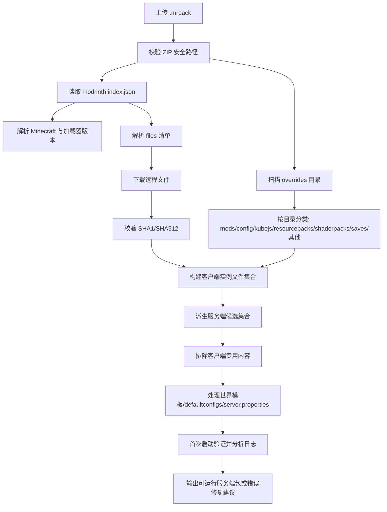

# Modrinth .mrpack 整合包共同规律分析

- 分析时间：2026-07-19 14:12:11
- 对比对象：`BattleArmory TACZ 1.6.4-hotfix.2.mrpack` 与 `乌托邦探险之旅3.5.2.mrpack`

## 1. 一句话结论

两个文件都遵循标准 Modrinth `.mrpack` 模式：根目录放 `modrinth.index.json`，实际实例内容放在 `overrides/`，大量 mod/资源通过索引里的 `files[]` 从 `cdn.modrinth.com` 下载。对自动开服器来说，通用规律是：**先解析索引安装 MC/加载器和远程文件，再合并 overrides，最后做服务端净化和首次启动验证**。

## 2. 基本信息对比

| 项目 | BattleArmory TACZ | 乌托邦探险之旅 |
|---|---:|---:|
| 源文件大小 | 320.68 MB | 718.64 MB |
| ZIP 文件条目数 | 1620 | 2695 |
| ZIP 解压后大小 | 379.90 MB | 798.94 MB |
| 整合包名称 | BattleArmory TACZ | 乌托邦探险之旅3.5.2 |
| 版本 | 1.6.4-hotfix.2 | 3.5.2 |
| Minecraft | 1.20.1 | 1.20.1 |
| 加载器 | Forge 47.4.20 | Fabric Loader 0.18.4 |
| 远程清单文件数 | 90 | 413 |
| 远程声明总大小 | 295.17 MB | 821.05 MB |
| overrides 文件数 | 1619 | 2694 |
| overrides 解压大小 | 379.86 MB | 798.76 MB |
| 本地嵌入 jar 数 | 11 | 63 |

## 3. 共同顶层结构规律

两个包的顶层结构都非常一致：

| 顶层结构 | 共同规律 | 开发含义 |
|---|---|---|
| `modrinth.index.json` | 必有，且位于 ZIP 根目录 | 这是第一入口，必须先读它，不要先盲目解压整个包 |
| `overrides/` | 两个包都大量使用 | `overrides/` 的内容要复制到实例根目录，但服务端生成时需要筛选 |
| `server-overrides/` | 两个包都没有 | 不能期待包作者已经给出服务端专用覆盖层 |
| `client-overrides/` | 两个包都没有 | 客户端专用内容混在普通 `overrides/` 里，需要二次识别 |

## 4. modrinth.index.json 的共同规律

共同字段：

- `formatVersion`: 当前两个包都是 `1`
- `game`: 都是 `minecraft`
- `name` / `versionId`: 用于显示和版本识别
- `dependencies`: 声明 Minecraft 版本和加载器版本
- `files[]`: 远程文件清单，包含目标路径、hash、下载 URL、大小、环境标记

差异也很重要：

- BattleArmory TACZ 使用 Forge：`{'minecraft': '1.20.1', 'forge': '47.4.20'}`
- 乌托邦探险之旅使用 Fabric：`{'fabric-loader': '0.18.4', 'minecraft': '1.20.1'}`
- BattleArmory TACZ 的 `files[].env` 全部省略；乌托邦探险之旅的 `files[].env` 全部是 `required/required`。所以自动开服器不能假设 env 一定存在，也不能只靠 env 判断服务端兼容性。

## 5. 远程清单 files[] 规律

| 指标 | BattleArmory TACZ | 乌托邦探险之旅 |
|---|---:|---:|
| 远程文件数量 | 90 | 413 |
| `mods/` 文件数 | 89 | 388 |
| `resourcepacks/` 文件数 | 0 | 20 |
| `shaderpacks/` 文件数 | 1 | 5 |

共同点：两个包的远程下载域名都只出现 `cdn.modrinth.com`。这对实现下载器很友好：可以统一做 URL 下载、hash 校验、失败重试、并发下载和缓存。

但是路径不只可能是 `mods/`：第二个包的远程清单还包含 `resourcepacks/` 和 `shaderpacks/`。自动开服器不要写死“files[] 都是 mod jar”。

## 6. overrides 目录共同规律

| overrides 子目录 | BattleArmory TACZ | 乌托邦探险之旅 | 规律 |
|---|---:|---:|---|
| `.addurdisc` | 0 文件 / 0 B | 131 文件 / 137.83 MB | 包特有内容，不能丢弃前需理解用途 |
| `CustomSkinLoader` | 1 文件 / 2.39 KB | 1 文件 / 2.52 KB | 常见实例覆盖内容，需要分类处理 |
| `PCL` | 14 文件 / 67.98 KB | 2 文件 / 1.72 MB | 常见实例覆盖内容，需要分类处理 |
| `TrashSlotSaveState.json` | 0 文件 / 0 B | 1 文件 / 1.29 KB | 包特有内容，不能丢弃前需理解用途 |
| `config` | 1209 文件 / 19.07 MB | 793 文件 / 96.06 MB | 常见实例覆盖内容，需要分类处理 |
| `defaultconfigs` | 0 文件 / 0 B | 8 文件 / 1.36 KB | 会影响玩法/世界/服务端，需要重点处理 |
| `emotes` | 0 文件 / 0 B | 150 文件 / 7.19 MB | 包特有内容，不能丢弃前需理解用途 |
| `ffmpeg.exe` | 0 文件 / 0 B | 1 文件 / 81.53 MB | 包特有内容，不能丢弃前需理解用途 |
| `icon.png` | 0 文件 / 0 B | 1 文件 / 1.72 MB | 包特有内容，不能丢弃前需理解用途 |
| `kubejs` | 0 文件 / 0 B | 439 文件 / 110.15 MB | 会影响玩法/世界/服务端，需要重点处理 |
| `mods` | 11 文件 / 10.40 MB | 63 文件 / 107.85 MB | 常见实例覆盖内容，需要分类处理 |
| `options.txt` | 1 文件 / 12.08 KB | 1 文件 / 18.78 KB | 常见实例覆盖内容，需要分类处理 |
| `resourcepacks` | 3 文件 / 10.26 MB | 25 文件 / 222.36 MB | 常见实例覆盖内容，需要分类处理 |
| `saves` | 324 文件 / 62.26 MB | 0 文件 / 0 B | 会影响玩法/世界/服务端，需要重点处理 |
| `shaderpacks` | 1 文件 / 1.08 MB | 1078 文件 / 32.32 MB | 常见实例覆盖内容，需要分类处理 |
| `tacz` | 11 文件 / 276.10 MB | 0 文件 / 0 B | 包特有内容，不能丢弃前需理解用途 |
| `xaero` | 44 文件 / 620.58 KB | 0 文件 / 0 B | 包特有内容，不能丢弃前需理解用途 |

共同点可以抽象成几类：

- **配置类**：`config/`、`defaultconfigs/`，决定模组行为和世界默认配置。
- **本地模组类**：`overrides/mods/`，不在远程清单中，必须合并进最终实例。
- **资源类**：`resourcepacks/`、`shaderpacks/`、自定义 assets，通常偏客户端，但可能影响体验或被整合包强依赖。
- **玩法脚本/内容包类**：如 `kubejs/`、`tacz/`，这是整合包的核心自定义内容。
- **用户实例状态类**：`options.txt`、`PCL/`、`xaero/`、`CustomSkinLoader/`，一般不适合作为服务端核心文件。

## 7. 两个包暴露出的自动开服关键规则

### 7.1 不要只处理 modrinth.index.json

两个包都把大量关键内容放在 `overrides/`。BattleArmory 的 TACZ 内容包、自带枪战地图；乌托邦的 KubeJS 资源、音乐资源、资源包、本地 jar 都不会仅靠 `files[]` 自动复原。

### 7.2 不要把 overrides 全量塞进服务端

`overrides/` 里混有客户端配置、启动器配置、光影、小地图、UI、资源包、甚至可执行文件。服务端生成器应按目录和文件类型分类，而不是无脑复制。

### 7.3 本地 jar 与远程 jar 必须合并

BattleArmory 本地嵌入 jar：11 个；乌托邦本地嵌入 jar：63 个。这说明很多作者会把非 Modrinth、私有、改版或特殊用途 jar 放在 overrides/mods。

### 7.4 env 标记只能作为参考

一个包完全省略 env，另一个包全部 required/required。实际服务端兼容性还要看 jar 元数据、mod loader、启动日志和已知客户端 mod 规则。

### 7.5 预置世界和脚本要特殊对待

BattleArmory 有 `saves/枪战地图`，乌托邦有 `kubejs/` 和 `defaultconfigs/`。自动开服器需要识别“世界模板”和“服务端脚本/配置模板”，并映射到 dedicated server 的目录结构。

## 8. 推荐的通用解析流程

## 9. 建议的数据模型

开发时可以把 `.mrpack` 解析结果抽象成这些对象：

- `PackMeta`: name、versionId、minecraftVersion、loader、loaderVersion。
- `RemoteFile`: path、size、hashes、downloads、env、downloadStatus。
- `OverrideFile`: path、category、size、extension、classification。
- `ContentLayer`: remote、overrides、clientOnly、serverCandidate、serverRequired。
- `ServerBuildPlan`: loaderInstall、modsToInclude、modsToExclude、configs、worldTemplate、resourcePolicy、launchCommand。
- `ValidationResult`: missingFiles、clientOnlyCrashes、loaderErrors、licenseWarnings、manualActions。

## 10. 对这两个样本的开发启发

- `.mrpack` 是“索引 + 覆盖层”，不是完整的单一服务端包。
- `files[]` 是可下载依赖层，`overrides/` 是作者自定义层。两层都不能省。
- 服务端生成必须支持 Forge 和 Fabric 的加载器安装分支。
- 目录分类规则比单纯扩展名判断更可靠，但仍需 jar 元数据和日志验证兜底。
- 需要明确安全策略：禁止路径穿越；对 `.exe` 等可执行文件只记录，不应放入 Linux 服务端运行目录。
- 最终产品最好提供“客户端实例生成”和“服务端包生成”两个模式，因为二者保留的文件集合不同。

## 11. 第二个包生成的辅助清单

- `Utopia_Adventure_3.5.2_manifest_files.csv`
- `Utopia_Adventure_3.5.2_overrides_files.csv`

## 12. 第二个包重要文件 Top 25

| 解压大小 | 路径 |
|---:|---|
| 208.15 MB | `overrides/resourcepacks/乌托邦自定义音乐版本3.5.zip` |
| 81.53 MB | `overrides/ffmpeg.exe` |
| 34.17 MB | `overrides/mods/【FTB背景】ftbanime-1.0.0.jar` |
| 21.28 MB | `overrides/mods/[超多生物群系] BiomesOPlenty-fabric-1.20.1-19.0.0.96.jar` |
| 18.90 MB | `overrides/shaderpacks/【国创】Derivative Main d24.4.14.zip` |
| 13.37 MB | `overrides/kubejs/assets/kubejs/textures/ftb_quests_background/map.png` |
| 11.57 MB | `overrides/mods/【死亡动画】KltytonDeathScreen-1.0.1.jar` |
| 9.03 MB | `overrides/resourcepacks/绿色行星.zip` |
| 7.15 MB | `overrides/config/customsplashscreen/background.png` |
| 6.96 MB | `overrides/config/roughlyenoughitems/unihan.zip` |
| 5.08 MB | `overrides/config/fancymenu/assets/ui/portal2.png` |
| 5.06 MB | `overrides/kubejs/assets/kubejs/textures/ftb_quests_background/logo2.png` |
| 4.55 MB | `overrides/mods/【结构兼容】Fantastic_Remastered_Structures_1.20+1.20.6-0.5_For+fab.jar` |
| 4.55 MB | `overrides/mods/[自然主义] naturalist-5.0pre5+fabric-1.20.1.jar` |
| 4.54 MB | `overrides/.addurdisc/assets/addurdisc/sounds/kim_jessie.ogg` |
| 4.44 MB | `overrides/.addurdisc/assets/addurdisc/sounds/hometown.ogg` |
| 4.43 MB | `overrides/config/fancymenu/slideshows/background/images/image_18.png` |
| 4.24 MB | `overrides/config/fancymenu/assets/ui/portal.png` |
| 4.16 MB | `overrides/mods/【生物神话坐骑】mythic-mounts-1.20.1-7.4.jar` |
| 4.08 MB | `overrides/config/physicsmod/physics_blocks_client_config.json` |
| 4.04 MB | `overrides/.addurdisc/assets/addurdisc/sounds/merry_christmas_mr_lawrence.ogg` |
| 3.96 MB | `overrides/.addurdisc/assets/addurdisc/sounds/luo_jing.ogg` |
| 3.91 MB | `overrides/.addurdisc/assets/addurdisc/sounds/everywhere_we_o.ogg` |
| 3.85 MB | `overrides/.addurdisc/assets/addurdisc/sounds/miyazaki_hayao.ogg` |
| 3.82 MB | `overrides/.addurdisc/assets/addurdisc/sounds/shine.ogg` |